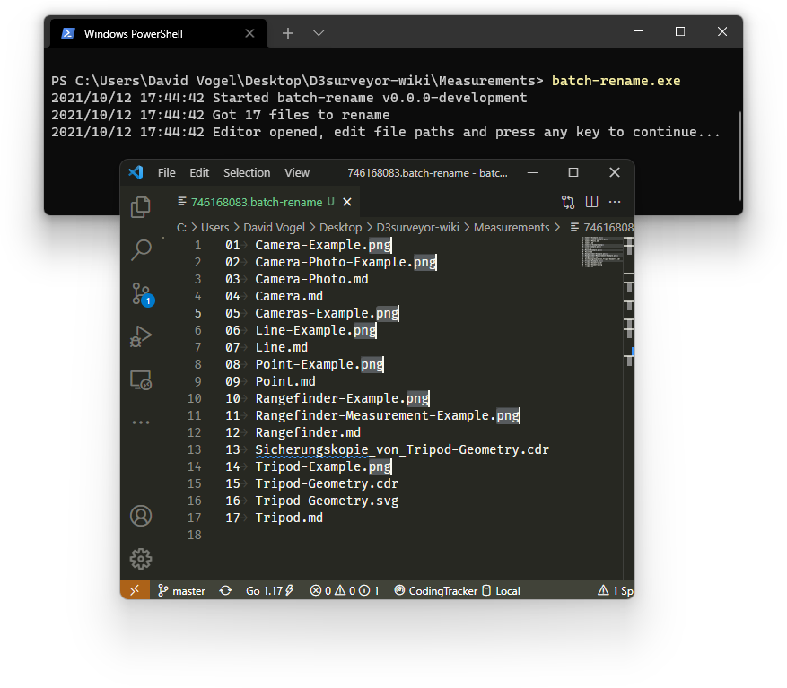

# batch-rename

With `batch-rename` you can utilize your favorite text editor to rename or move a bunch of files at once.
It doesn't come with any features beside the core function.
You only need to start the tool in any directory, and it will open a list of paths inside your preferred editor ready for you to edit.

When run from inside some directory, this program will:

1. Create a temporary file with a list of all files contained in the given directory and its sub directories
2. Opens the temporary file with the default editor (For files with the file extension `.batch-rename`)
3. Reads the file back, and renames/moves the files

## Usage

There are multiple ways to use this tool:

- Download the compiled binary, then move and execute it into the directory you want to rename files in.
- Download the compiled binary, and move it to any directory that is in your `path` environment variable. Afterwards you can run `batch-rename` from inside any directory.
- Use `go install github.com/Dadido3/batch-rename@latest`. Afterwards you can run `batch-rename` from inside any directory.
- Build it yourself from source, see below.

## Building

This software uses GoReleaser to automatically build and upload artifacts to GitHub.
Make sure to [install GoReleaser](https://goreleaser.com/install/).

- To build for your current platform use `goreleaser build --single-target --clean`. Or `goreleaser build --single-target --snapshot --clean` if you have modified the repository.
- To simulate the release process, use `goreleaser --skip-publish --auto-snapshot --clean`.
- To build for your current platform and without GoReleaser, use `go build`. This will not include the version information.
